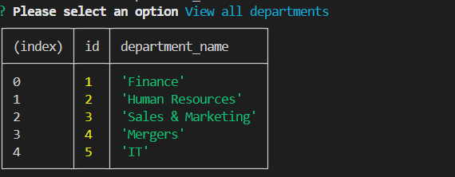
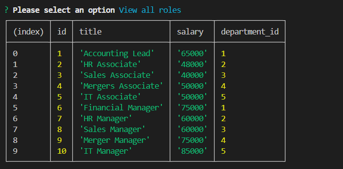
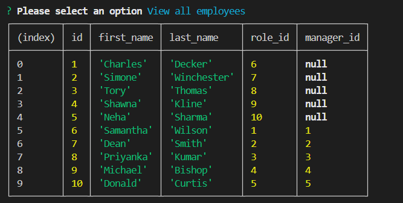
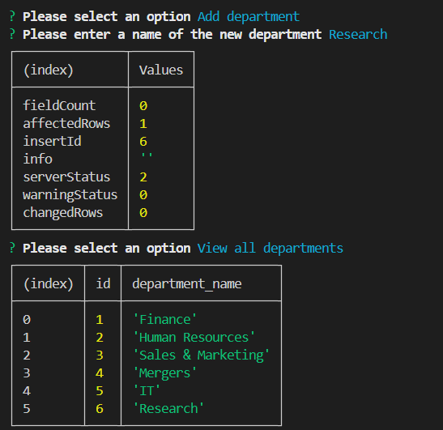
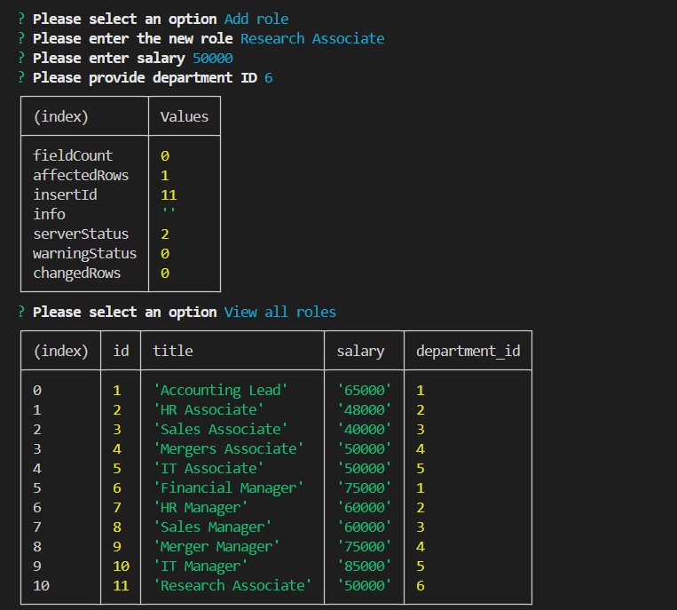
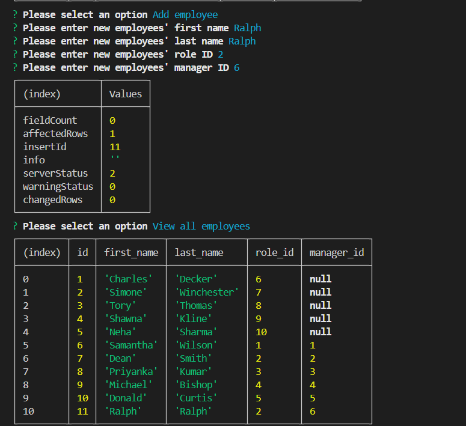
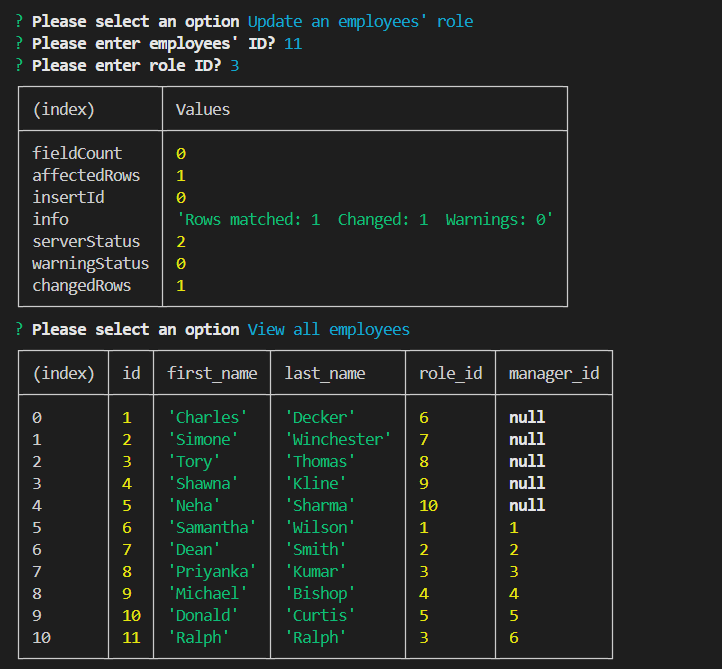

# 12-Challenge-Employee-Tracker

## User Story

```md
AS A business owner
I WANT to be able to view and manage the departments, roles, and employees in my company
SO THAT I can organize and plan my business
```

## Acceptance Criteria

```md
GIVEN a command-line application that accepts user input
WHEN I start the application
THEN I am presented with the following options: view all departments, view all roles, view all employees, add a department, add a role, add an employee, and update an employee role
WHEN I choose to view all departments
THEN I am presented with a formatted table showing department names and department ids
WHEN I choose to view all roles
THEN I am presented with the job title, role id, the department that role belongs to, and the salary for that role
WHEN I choose to view all employees
THEN I am presented with a formatted table showing employee data, including employee ids, first names, last names, job titles, departments, salaries, and managers that the employees report to
WHEN I choose to add a department
THEN I am prompted to enter the name of the department and that department is added to the database
WHEN I choose to add a role
THEN I am prompted to enter the name, salary, and department for the role and that role is added to the database
WHEN I choose to add an employee
THEN I am prompted to enter the employee’s first name, last name, role, and manager, and that employee is added to the database
WHEN I choose to update an employee role
THEN I am prompted to select an employee to update and their new role and this information is updated in the database 
```

## Technologies used
* nodejs
* mysql
* Youtube

## Getting Started
* npm init to create package.json file, it will contain basic information and dependencies you need to install to run the application. 
* npm i to install the dependencies mentioned in package.json file and node_modules. 
* mysql -u root -p to start mysql. 
* source schema.sql to create schemas defined in your database. 
* source seeds.sql to create schema data using values/seeds in your seeds file.
* npm start to run the application.  

## Screenshots showing working applciation

* view all departments



* View all roles 



* view all employees



* Add a new department



* Add a new role



* Add a new employee



* Update employee role



## Link to the video
https://drive.google.com/file/d/1nLB_UVfDWKNoOnQ2hEyfEFIFDAvuAZ1R/view?usp=sharing

## Link to Github repository
https://github.com/Rubal103/12-Challenge-Employee-Tracker


